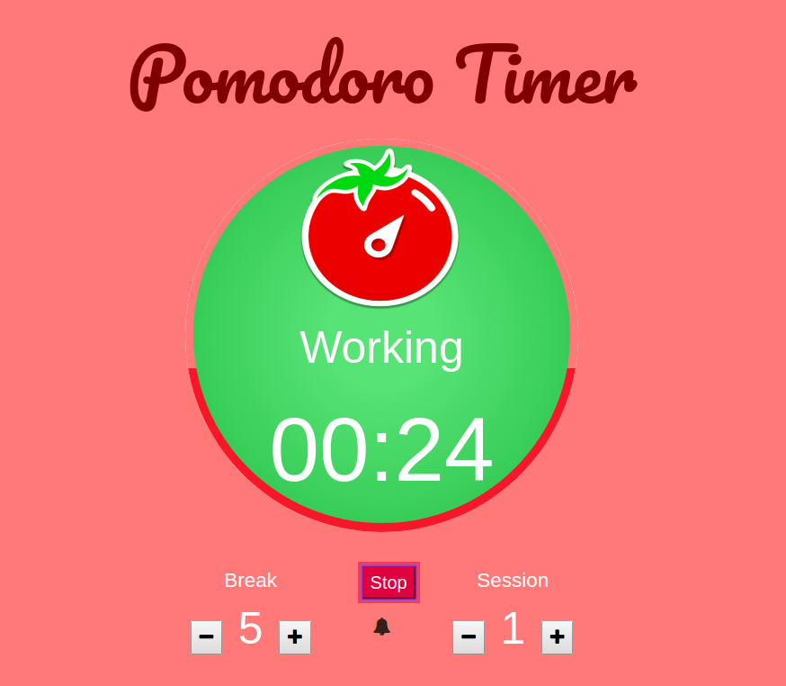

# What I do
For front-end side, I use jQuery, which is JavaScript library. And I use popular framework, called bootstrap.People can use its remote version or package in file, so you can see the effect of on the browser without dowloading the whole library.
Some useful link I used:
https://mdbootstrap.com/css/animations/

I try to use php to submit simple forms and connect it to the web server called Apache.
